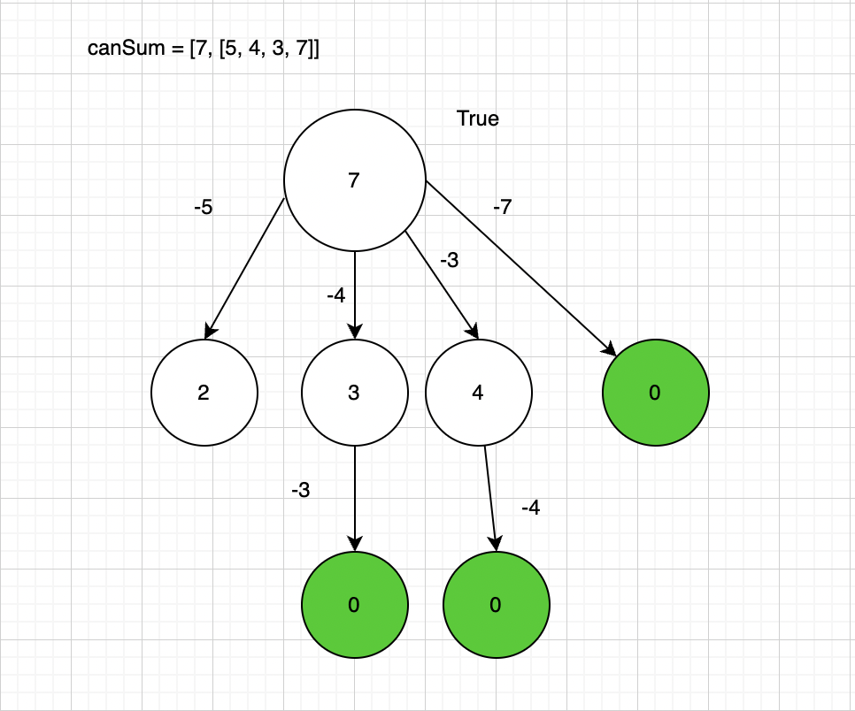
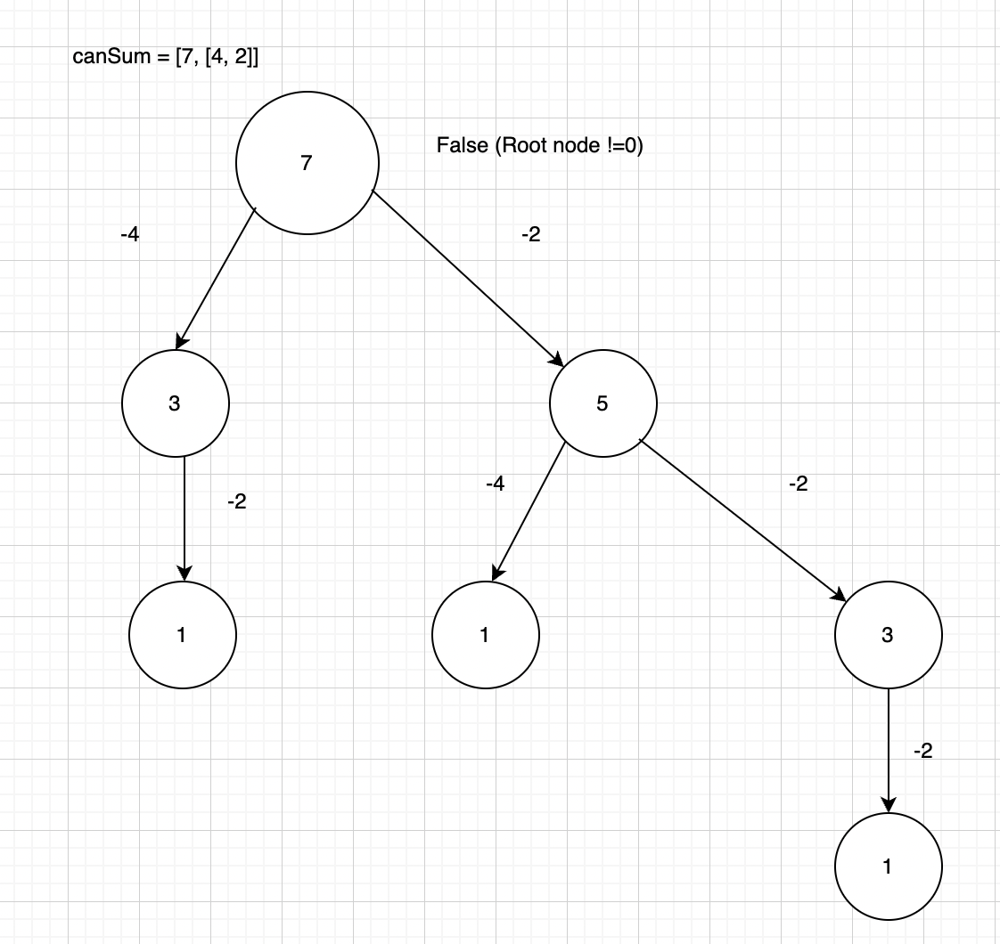

## CanSum Problem Statement

Write a function canSum(targetSum, numbers) that takes in a targetSum and an array of numbers as arguments.
  The function should return a boolean indicating whether 
or not it is possible to generate the targetSum using numbers from the array.

You may use an element of the array as many times as needed. All input numbers are non-negative. 
## Positive Case

## Negative Case

<u>Brute Force:</u>

Time Complexity: O(nm)
 Space Complexity: O(m)

<u>Memoized Approach:</u>
Use HashMap to store recursive results and avoid recomputing duplicate nodes.

Time Complexity: O(n*m)
 Space Complexity: O(m)