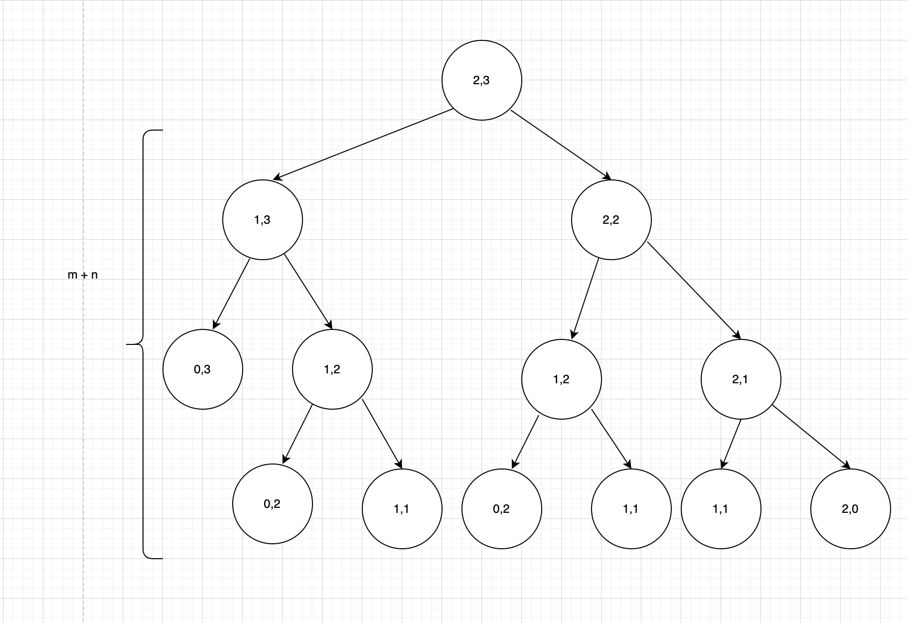
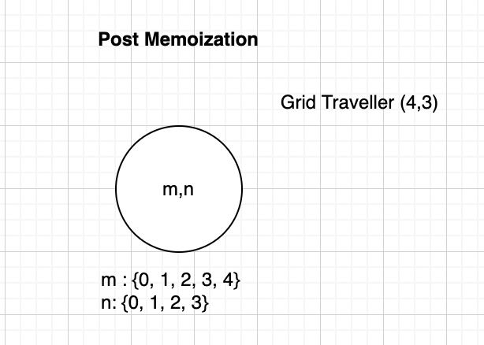

## Grid Traveller Problem Statement
![https://leetcode.com/problems/unique-paths/] 

There is a robot on an m x n grid. The robot is initially located at the top-left corner (i.e., grid[0][0]). The robot tries to move to the bottom-right corner (i.e., grid[m - 1][n - 1]). The robot can only move either down or right at any point in time.

Given the two integers m and n, return the number of possible unique paths that the robot can take to reach the bottom-right corner.

The test cases are generated so that the answer will be less than or equal to 2 * 109.

## Grid Traveller Memoization Approach

### Alvin's Memoization Recipe
![https://www.youtube.com/watch?v=oBt53YbR9Kk&t=694s]

 1. Make It Work 
     1. Visualize problem as a tree
       (Sample Visualization for 3 * 3 grid) 
         
     2. Implement the tree using recursion  
         3. Test it 
    *Time Complexity*: O(2m+n)
     *Space Complexity*: O(m+n)
 2. Make it efficient
    1. Add a memo object(HashMap) 
     
        *Time Complexity*: O(m*n)
        *Space Complexity*: O(m+n)